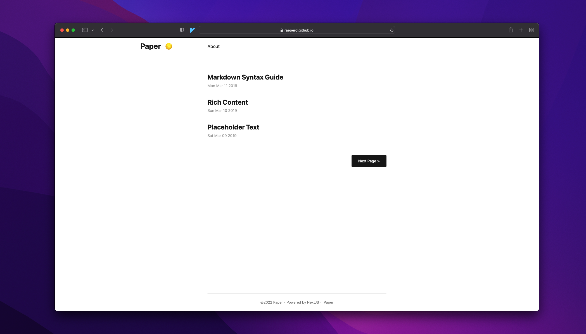
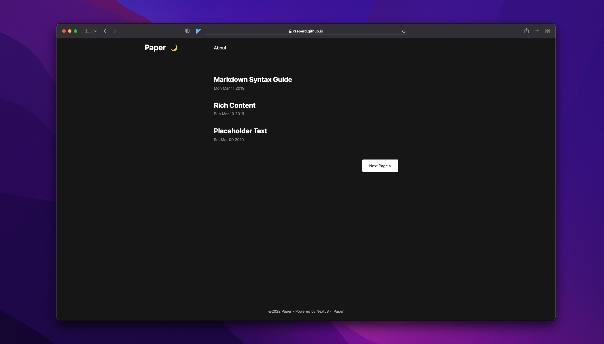
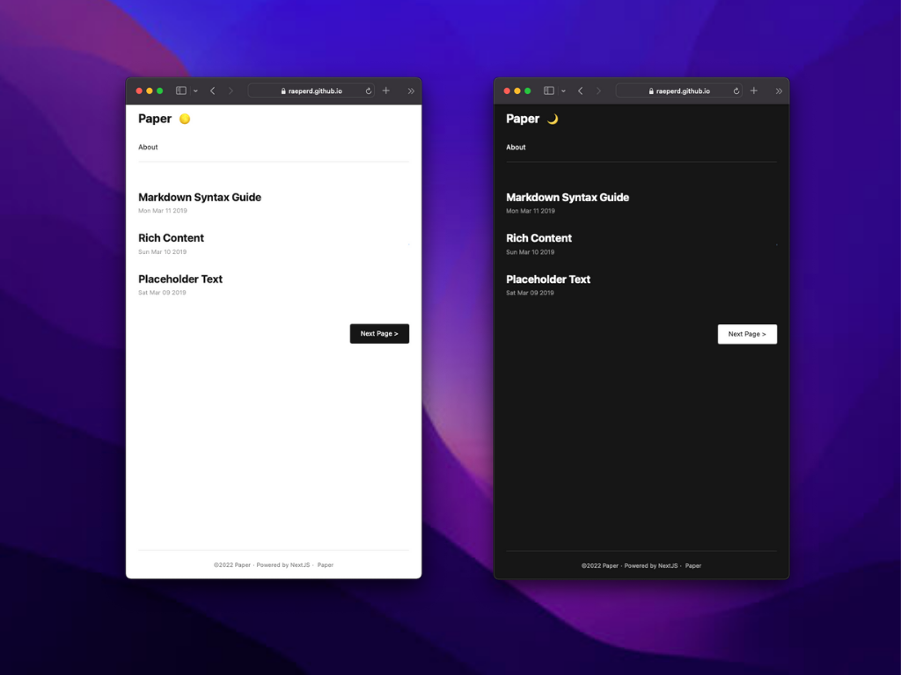

# [raeperd.github.io](https://raeperd.github.io/)
[](https://github.com/raeperd/nextjs-paper/actions/workflows/gh-pages.yml)
[](https://sonarcloud.io/summary/new_code?id=raeperd_raeperd.github.io)
[](https://sonarcloud.io/summary/new_code?id=raeperd_raeperd.github.io)
[](https://sonarcloud.io/summary/new_code?id=raeperd_raeperd.github.io)  
A simple, clean, flexible NextJS blog using [raeperd/nextjs-paper](https://github.com/raeperd/nextjs-paper) 


# Overview





# Feature
- [#1](https://github.com/raeperd/raeperd.github.io/issues/1) Preserve markdown file links as url links (such as [Obsidian](https://obsidian.md/), [Typora](https://typora.io/))
- [#7](https://github.com/raeperd/raeperd.github.io/issues/7) Paginate over tags 
- [#11](https://github.com/raeperd/raeperd.github.io/issues/11) Download markdown notes using [raeperd/google-drive-download-action](https://github.com/raeperd/google-drive-download-action)

## Feature by [raeperd/nextjs-paper](https://github.com/raeperd/nextjs-paper)
- GFM supports with tables using [remarkjs/remark-gfm](https://github.com/remarkjs/remark-gfm)
- Katex inline math using [remarkjs/remark-math](https://github.com/remarkjs/remark-math/tree/main/packages/remark-math) and [remarkjs/remark-katex](https://github.com/remarkjs/remark-math/tree/main/packages/rehype-katex) 
- Syntax highlighting using [react-syntax-highlighter](https://github.com/react-syntax-highlighter/react-syntax-highlighter) 
- Inner HTML using [rehypejs/rehype-raw](https://github.com/rehypejs/rehype-raw) 
- Disqus comments using [disqus/disqus-react](https://github.com/disqus/disqus-react) 
- Dark mode using [juliencrn/usehooks-ts](https://github.com/juliencrn/usehooks-ts) 

You can check out my commits if you interested
- [#9 Add GFM supports for tables · raeperd/nextjs-paper@34adc4f](https://github.com/raeperd/nextjs-paper/commit/34adc4f1c303a7c92ba85162a08433d011473c17)
- [#9 Add katex support for markdown · raeperd/nextjs-paper@2a92094](https://github.com/raeperd/nextjs-paper/commit/2a920947963b64af016048ba15f7f976fb2fa2ac)
- [#9 Implements syntax highlighting in article · raeperd/nextjs-paper@bdaa61a](https://github.com/raeperd/nextjs-paper/commit/bdaa61a1b5df950d319e05bc9b4c0b018e9f45b5)
- [#9 Add inner html supports for markdown · raeperd/nextjs-paper@28a8a58](https://github.com/raeperd/nextjs-paper/commit/28a8a58220a83ccc17e8c28fc9d1a69bd08baa40)
- [#17 Implements disqus comment feature · raeperd/nextjs-paper@31cc756](https://github.com/raeperd/nextjs-paper/commit/31cc756942136a58804bc2e3b995d8530c9837f5)
- [#2 Implements DarkMode toggle · raeperd/nextjs-paper@d42fa05](https://github.com/raeperd/nextjs-paper/commit/d42fa057f1ad28a6f43fde2a2ff489bd399d48e0)

# Install

```shell
npm run server
```

You can also serve this page with static htmls after build (which is recommended)

```shell
npm run build && npm run export
```


# Configurations

## [next.config.js](./next.config.js) file

```javascript
module.exports = {
  env: {
    SITE_NAME: 'raeperd.github.io',
    GITHUB: 'raeperd',
    INSTAGRAM: 'raeperd',
    TWITTER: 'raeperd117',
    AUTHOR: 'raeperd',
    PAGE_SIZE: 10,
  },
  images: {
    loader: 'akamai',
    path: '',
  },
  webpack(config) {
    config.module.rules.push({
      test: /\.svg$/i,
      issuer: /\.[jt]sx?$/,
      use: ['@svgr/webpack'],
    })

    return config
  },
}
```

# Notes

- 🙅🏻 Multilingual is not supported  
- ⚙️ Build time may increase, as you want to have many markdown files 

# License
[](https://opensource.org/licenses/MIT)

# Contacts
raeperd117@gmail.com

# Thanks to

* [nanxiaobei/hugo-paper: 🪴 A simple, clean, flexible Hugo theme](https://github.com/nanxiaobei/hugo-paper)
* [remarkjs/remark-gfm: remark plugin to support GFM (autolink literals, footnotes, strikethrough, tables, tasklists)](https://github.com/remarkjs/remark-gfm)
* [remark-math/packages/remark-math at main · remarkjs/remark-math](https://github.com/remarkjs/remark-math/tree/main/packages/remark-math)
* [remark-math/packages/rehype-katex at main · remarkjs/remark-math](https://github.com/remarkjs/remark-math/tree/main/packages/rehype-katex)
* [react-syntax-highlighter/react-syntax-highlighter: syntax highlighting component for react with prismjs or highlightjs ast using inline styles](https://github.com/react-syntax-highlighter/react-syntax-highlighter)
* [rehypejs/rehype-raw: plugin to parse the tree again](https://github.com/rehypejs/rehype-raw)
* [disqus/disqus-react: A React component for Disqus](https://github.com/disqus/disqus-react)
* [juliencrn/usehooks-ts: React hook library, ready to use, written in Typescript.](https://github.com/juliencrn/usehooks-ts)
